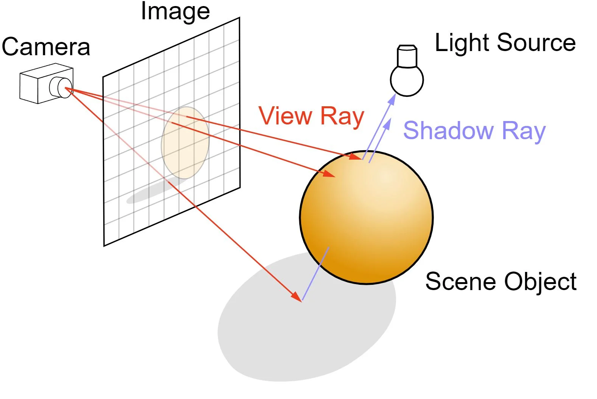
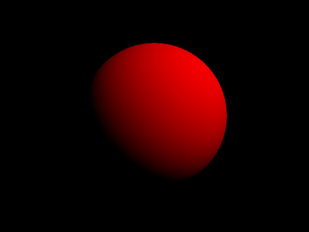

# Project (SAÉ) S3.A.01 - Development of an application

> * Project started on 23/10/2023
> * Group N°15
> * Students involved : 
>   * Abdelkader Dai
>   * Adel Djedid
>   * Antoine Grasso
>   * Théo Vanbandon

## Sommaire

1. [Project context](#1-project-context)

   1.1 [What is raytracing?](#11-what-is-raytracing)

2. [Explanation of the project](#2-explanation-of-the-project)

   2.1 [Input file](#21-input-file)

   2.2 [Application launch](#22-application-launch)

3. [Results to be obtained](#3-results-to-be-obtained)

4. [Project structure](#4-project-structure)

5. [Project goals](#5-project-goals)

6. [Wiki](#6-wiki)

# 1. Project context
As part of our studies in BUT Informatique, we have to create an application in which we have to create a raytracing library.

## 1.1 What is raytracing ?
Ray tracing enables the computer to generate images with a 3D effect, by simulating the path of light
of light within a scene, in which objects are illuminated by this light.



# 2. Explanation of the project
## 2.1 Input file
Our library must be able to take a text file (.txt) as input. This will indicate the parameters of the image to be displayed.

Here's an example:

```
size 640 480

output scene.png
camera 0 0 4 0 0 0 0 1 0 45

ambient 1 0 0

sphere 0 0 0 1
```

In this example, "size 640 480" defines the size of the image to be created.

"Output scene.png" is used to store the generated image in the file of the specified name. Here it's 'scene.png'.

Here, the camera is positioned at (0, 0, 4), looking at the center of the scene (0, 0, 0), the upper position along the y-axis (0, 1, 0), with a viewing angle of 45 degrees => "camera 0 0 4 0 0 0 0 1 0 45"

The "ambient" function then represents the ambient color in (R, G, B). => "ambient 1 0 0"

With "sphere 0 0 0 1", a sphere is declared by its center and radius.
sphere x y z r for a sphere with center (x, y, z) and radius r

## 2.2 Application launch
This application must be able to be run from the command line as an independent program.

# 3. Results to be obtained
```
size 640 480
output exemple2.png
camera 0 0 4 0 0 0 0 1 0 45

ambient 0 0 1

maxverts 3

vertex +1 +1 0
vertex +1 -1 0
vertex -1 -1 0

tri 0 1 2
```


```
size 640 480
output exemple3.png
camera 0 0 4 0 0 0 0 1 0 45

diffuse 1 0 0
directional 1 1 1 1 1 1

sphere 0 0 0 1
```



# 4. Project structure

In our project, we have different packages that allow us to differentiate between classes.

So we have the [coordinate package](src/main/java/coordinate/), which contains the classes that deal with coordinates.

We also have the [object package](src/main/java/object/), which contains classes for objects such as triangles and spheres.

Finally, we have the [scene package](src/main/java/scene/), which contains the classes that create the scene (camera, color, light, raytracer...).

# 5. Project goals
- Gain experience in Java programming.
- Acquire new java skills
- Gain autonomy
- Discover the principle of ray tracing
- Working in a group
- Project management with Git

# 6. Wiki

If you want some details about our project and more precisely about programms, you can go on our [Wiki](https://gitlab.univ-artois.fr/abdelkader_dai/sae_s3_2023-204/-/wikis/RayTracing-home)